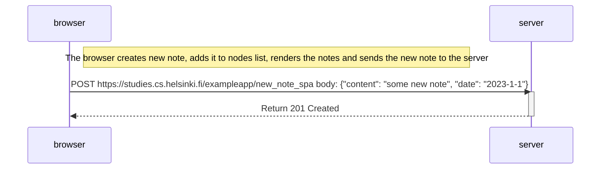

# 0.6

```mermaid
sequenceDiagram
    participant browser
    participant server

    Note right of browser: The browser creates new note, adds it to nodes list, renders the notes and sends the new note to the server

    browser->>server: POST https://studies.cs.helsinki.fi/exampleapp/new_note_spa body: {"content": "some new note", "date": "2023-1-1"}
    activate server
    server-->>browser: Return 201 Created
    deactivate server
```